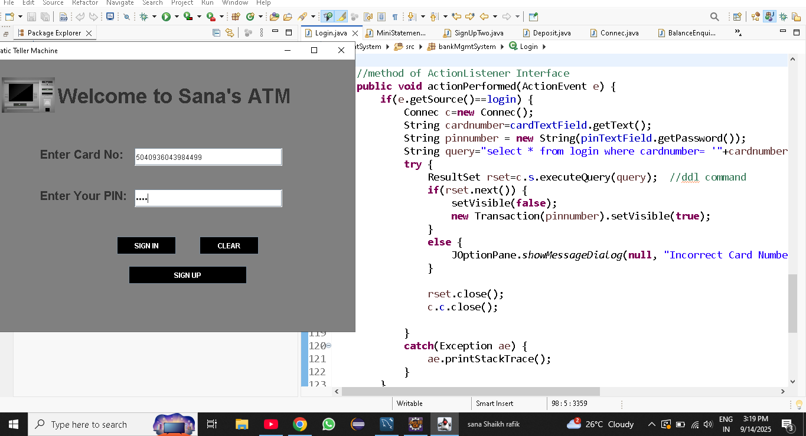
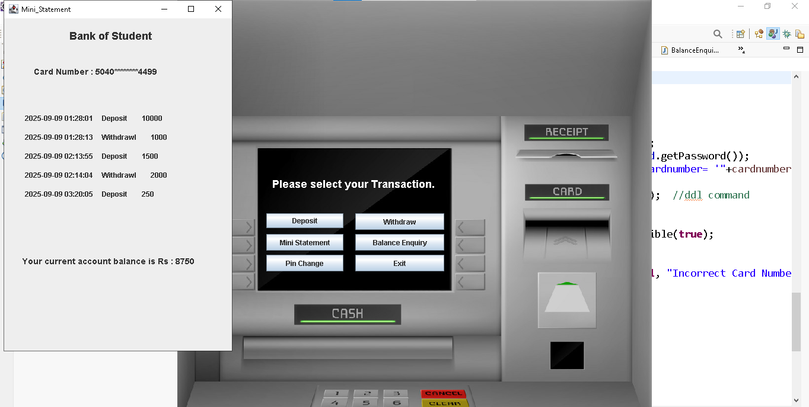
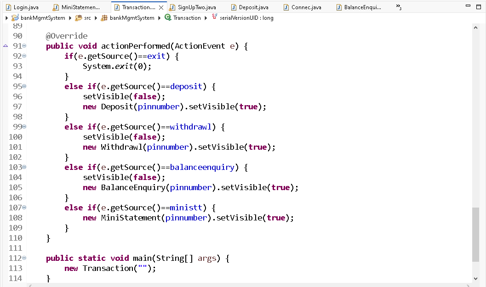

# 💳 Bridge-Bank-ATM-Simulator

## 📌 Project Overview
It is a Java-based desktop application that simulates an **ATM (Automatic Teller Machine)** interface.  
It allows users to log in using a card number and PIN, perform basic banking transactions, and register for new accounts.  

This project demonstrates **Java Swing** for GUI design, **JDBC** for database connectivity, and **MySQL** for backend data storage.


## 🛠️ Tech Stack
- **Java (JDBC, Swing, AWT)** → Application logic & GUI  
- **MySQL** → Database for storing user details and transactions  
- **Eclipse IDE** → Development environment  
- **Git & GitHub** → Version control and hosting  

---

## ✨ Features
- 🔑 **Login System** → Secure login using card number & PIN  
- 📝 **Sign Up Functionality** → Register new users with account details  
- 💰 **Transaction Handling** → Deposit, Withdraw, Balance Enquiry *(if implemented in `Transaction.java`)*  
- ❌ **Clear Fields** → Reset input fields easily  
- 🔒 **Validation** → Ensures incorrect card/PIN are not accepted  
- 🎨 **User-Friendly GUI** → Designed with Java Swing  

---


## ***********Project Structure***********
/atmSystem
├── src/BridgeBankATMSimulator/
│ ├── Login.java # Login screen
│ ├── Connec.java # Database connection
│ ├── Transaction.java # Transactions page
│ ├── SignUpOne.java # User registration
│ └── ... (other files)
├── database/
│ └── BridgeBankDatabase.sql  # MySQL database export
├── .gitignore
└── README.md


## ********* Database Setup**********
1. Create a database in MySQL:
   ```sql
   CREATE DATABASE BridgeBankDatabase;

2.Import the provided SQL file:
mysql -u root -p atmSystem < database/BridgeBankDatabase.sql

3.Update Connec.java with your MySQL username & password:
	Connection c = DriverManager.getConnection(
    	"jdbc:mysql:///bankmgmtsystem", "root", "yourpassword");


##********How to Run*************
1.Clone this repository:
git clone https://github.com/Sana11Shaikh/Bridge-Bank-ATM-Simuator.git

2.Open the project in Eclipse IDE.

3.Import the BridgeBankDatabase.sql into MySQL.

4.Update DB credentials in Connec.java.

5.Run Login.java → Start the application.


##***********Screenshots******************
## 📸 Screenshots  

###  Login Page  
  

###  Sign Up Page  
  

###  Transaction Page  
  


##************What I Learned***********
1.Strengthened understanding of Java Swing, AWT, and JDBC.

2.Designed and integrated a MySQL database with Java (JDBC) for authentication.

3.Improved skills in event handling, GUI design, and modular coding.

4.Gained hands-on experience with Git & GitHub for version control.

